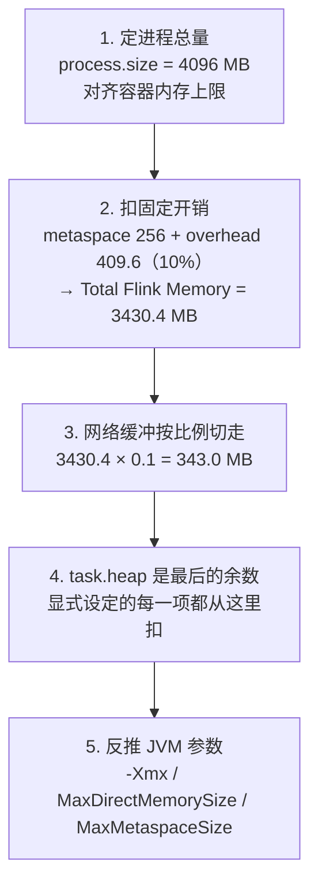
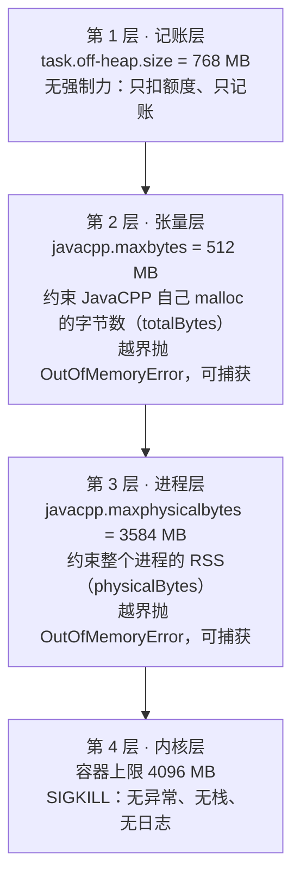
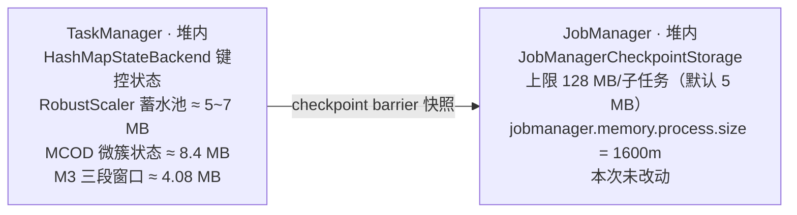
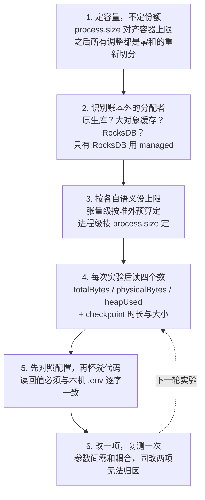

# Flink 内存模型、checkpoint 关联与调优参考（本项目实测版）

> **适用范围**：本项目的 Flink 1.13.6 standalone 集群，TaskManager 进程总量 4096 MB。
> **数据来源**：TaskManager 日志 `172.16.0.164:44395` 的 `jvm_params` / `dynamic_configs` 行、
> `deploy/env.example`、`docs/java11_migration_report.md`，以及用本项目 `LstmAutoEncoder` 在
> JDK 11 沙箱中的实测（`-Xms=-Xmx=1.89 GB`，与 TaskManager 同配置）。文中所有数字均为实测或
> 由实测值精确推导，不是估算。
> **写作缘由**：M3 阶段引入 Deeplearning4j 后做了一次堆外内存重新分配，过程中踩了两个坑；本文
> 把机制、本次调整的依据、与 checkpoint 的关系，以及可复用的调优流程一并固化下来。

---

## 一、RSS 是什么

**RSS（Resident Set Size，常驻内存集）是操作系统统计的、一个进程当前真正占用物理内存的字节数。**
内核的 OOM killer 看它，容器内存上限管它，JavaCPP 的 `maxphysicalbytes` 比对的也是它。

四个容易混淆的量，差别在于「谁在统计、统计什么」：

| 指标 | 统计方 | 含义 | 本项目实测 |
|---|---|---|---|
| `heapCommitted` | JVM | JVM 向操作系统**要下**的堆空间。`-Xms` 等于 `-Xmx` 时启动即全额要下 | 1,936 MB |
| `heapUsed` | JVM | 堆中已被对象占用的部分，含尚未回收的垃圾 | 2 → 1,408 MB |
| `physicalBytes`（即 RSS） | 操作系统 | 进程**真正驻留**在物理内存的页。含被触碰过的堆页、元空间、线程栈、网络缓冲，以及 mmap 进来的 `.so` 代码段 | 42 → 2,571 MB |
| `totalBytes` | JavaCPP | 仅 JavaCPP 自己 malloc 出来的原生内存，即张量数据 | 0 → 8.07 MB |

理解 RSS 的关键在于区分「要下」与「驻留」。JVM 启动时 `heapCommitted` 已是 1,936 MB，但此刻 RSS
只有 42 MB——那些堆页还没有被写过，内核尚未给它们分配真实的物理页框。随着程序运行、堆页被逐一
触碰，RSS 才逐步爬升。

### 实测：张量很小，RSS 很大

下面是用项目自己的 `LstmAutoEncoder` 跑完整个隐藏层网格测得的三个时刻：

| 时刻 | 张量 `totalBytes` | `heapUsed` | RSS `physicalBytes` |
|---|---:|---:|---:|
| JVM 启动（ND4J 未加载） | 0 | 2 MB | 42 MB |
| 首次建模（触发原生库加载） | 0 | 68 MB | 197 MB |
| hidden=40 训练 10 轮 | 1.91 MB | 718 MB | 1,390 MB |
| hidden=60 训练 10 轮 | 4.13 MB | 970 MB | 2,139 MB |
| hidden=90 训练 10 轮 | 8.07 MB | 1,408 MB | 2,571 MB |

模型参数量（实测，与解析式 `5×4h + h×4h + 4h`（LSTM 层）加 `h×5 + 5`（输出层）吻合）：

| 隐藏层宽度 | LSTM 层参数 | 输出层参数 | 合计 | FP32 占用 |
|---:|---:|---:|---:|---:|
| 40 | 7,360 | 205 | 7,565 | 29.6 KB |
| 60 | 15,840 | 305 | 16,145 | 63.1 KB |
| 90 | 34,560 | 455 | 35,015 | 136.8 KB |

**结论**：张量数据全程不超过约 10 MB，而进程 RSS 可达 2,571 MB，相差两个数量级。吃内存的不是
模型，而是承载模型的运行时——原生库映射约 155 MB（RSS 从 42 跳到 197 就是这一步）、ND4J 工作区
（`WorkspaceModes` 为 ENABLED，预申请的内存池会增长到历史最大需求且不主动缩回），以及 Java 堆上
的对象与垃圾。因此在当前量级上，隐藏层宽度与窗口长度**不是**内存约束的来源，可以按精度需要来定。

---

## 二、4096 MB 按什么流程切分

Flink 的内存管理是**自顶向下的预算切分**，不是自底向上的累加。给定一个总量，Flink 按固定规则切成
互不重叠的区块，再据此反推 JVM 的启动参数。

### 2.1 本项目 TaskManager 的真实切分

| 区块 | 配置项 | 迁移前 | 迁移后 | 位置 | 谁在使用 |
|---|---|---:|---:|---|---|
| 框架堆 | `framework.heap.size` | 128 | 128 | 堆内 | Flink 运行时自身 |
| 任务堆 | `task.heap.size` | **1807.4** | **1807.4** | 堆内 | 算子代码中的 Java 对象、键控状态 |
| 托管内存 | `managed.size` | 1024 | **256** | 堆外 | 仅 RocksDB 状态后端与批处理排序 |
| 框架堆外 | `framework.off-heap.size` | 128 | 128 | 堆外 | Flink 运行时的直接内存 |
| 任务堆外 | `task.off-heap.size` | 0 | **768** | 堆外 | 算子使用的直接内存与原生内存 |
| 网络缓冲 | `network` | 343 | 343 | 堆外 | Shuffle 与反压的数据缓冲 |
| 元空间 | `jvm-metaspace.size` | 256 | 256 | 堆外 | 类元数据 |
| JVM 开销 | `jvm-overhead` | 409.6 | 409.6 | 堆外 | 线程栈、JIT 代码缓存、GC 结构 |
| **合计** | `process.size` | **4096** | **4096** | — | — |

按比例示意（每格约 82 MB）：

```
迁移后  ██ ██████████████████████ ███ ██ █████████ ████ ███ █████
        fw  task.heap 1807.4      mg  fo  t.off 768  net  ms  ovh
        128                       256 128            343  256 409.6

迁移前  ██ ██████████████████████ ████████████ ██ ████ ███ █████
        fw  task.heap 1807.4      managed 1024 fo  net  ms  ovh
        128                                    128 343  256 409.6
```

**`task.heap` 那一段宽度完全相同。** 这次调整是把 768 MB 从闲置的 managed 平移到 task.off-heap，
堆一个字节都没动。这一点直接决定了第三节的答案。

### 2.2 五步推导



第 4 步是零和关系的所在，也是本次调整的要害：

```
迁移后  task.heap = 3430.4 − 128 − 128 − 768 − 343 −  256 = 1807.4 MB
迁移前  task.heap = 3430.4 − 128 − 128 −   0 − 343 − 1024 = 1807.4 MB
```

第 5 步的结果可与日志第 7 行逐字核对：

```
-Xmx = framework.heap + task.heap = 128 + 1807.4 = 1935.4 MB
   ↳ 日志实测 -Xmx2029372037 字节 = 1935.4 MB                        ✓
-XX:MaxDirectMemorySize = framework.off-heap + task.off-heap + network
                        = 128 + 768 + 343 = 1239 MB
   ↳ 日志实测 1299227611 字节 = 1239 MB                              ✓
```

### 2.3 为什么还要额外加两道 JavaCPP 闸

因为上面那套参数**管不住原生内存**。`MaxDirectMemorySize` 只约束 `ByteBuffer.allocateDirect`
这类 NIO 直接内存；ND4J 是通过 C 的 `malloc` 直接向操作系统要内存的，不受它约束。而
`task.off-heap.size` 本身只是一个记账条目，只做两件事——从堆里扣额度、计入
`MaxDirectMemorySize`，**不具备任何强制力**。

于是形成四层防线：



设计意图是让问题在第 2 或第 3 层以可捕获、可记录的 Java 异常暴露出来，绝不让它滑到第 4 层变成
一次没有任何线索的容器消失。

约束关系：

```
maxbytes          ≤ task.off-heap.size            →   512 MB ≤  768 MB   ✓
maxphysicalbytes  ≈ process.size × 0.85 .. 0.90   →  3584 MB / 4096 MB   ✓
```

> **本次踩的坑**：`maxphysicalbytes` 曾按第 1 层的语义取成 768 MB，与 `task.off-heap.size` 对齐。
> 但它属于第 3 层，比对的是进程 RSS——TaskManager 仅完成启动与库加载 RSS 就已是 769 MB。报错现场
> 同时出现 `totalBytes = 0` 与 `physicalBytes = 769M`：一个字节的张量都没分配，进程就超限了。
> 两个参数名字很像，语义相差一个数量级，不可互相套用。

---

## 三、本次内存调整与 checkpoint 的关系

**结论：没有影响。** 两条理由都可以验算。

### 3.1 先回顾 2022 年三月那次事故

记录在 `deploy/env.example`（`SYN_M1_CKPT_MAX_STATE_MB` 一节）：

> 七天标定的 RobustScaler 预热蓄水池（每设备 60,480 轮 × 5 通道，装箱 `ListState<Double>`）
> 每子任务约 5~7 MB，越过 Flink 内存型 checkpoint 默认的 **5 MB/子任务**上限 → checkpoint 失败
> → 作业重启 → AT_LEAST_ONCE 重发 → `m1-out` 出现 14~24% 重复轮。

修复方式是把上限显式提到 128 MB（`M1Job` / `M2Job` 的 `--checkpoint-max-state-mb` 默认值）。

状态的存放路径：



集群无共享文件系统，故未采用 `FileSystemCheckpointStorage`，checkpoint 落在 JobManager 堆上。

### 3.2 第一条理由：堆没有变

第 2.2 节已验算：`task.heap` 迁移前后都是 1807.4 MB，`-Xmx` 都是 1935.4 MB。键控状态住在堆里，
堆的容量没变，因此能承载的状态规模没变。

### 3.3 第二条理由：managed 与 checkpoint 无关

被砍掉的 768 MB 来自 `managed`。这块内存由 Flink 自己分配和管理，只有 RocksDB 状态后端和批处理
排序算子会向它申请。本项目用的是 HashMapStateBackend，那 1024 MB 原本就是闲置的，**调小它不会
缩减任何状态容量**。

这也是一个常见误解：看到「托管内存」这个名字，以为调大它就能让状态或张量库多用内存。实际上它对
两者都不起作用——状态在堆上，张量在 `malloc` 出来的原生内存里。

### 3.4 M3 新增状态的核算

M3 新增了键控状态，需要核算是否会再次逼近 128 MB 上限。关键前提是**窗口不重叠**：`M3Function`
每攒满一个窗口就 `windowBuffer.clear()`，因此窗口数 = 轮数 ÷ `windowLength`(60)。

| 数据段 | 天数 | 轮数/设备 | 窗口数 | 单窗口 | 小计 |
|---|---:|---:|---:|---|---:|
| 训练集 | 7 | 60,480 | 1,008 | `double[300]` + `byte[300]` | 2.60 MB |
| 早停集 | 2 | 17,280 | 288 | 同上 | 0.74 MB |
| 阈值标定集 | 2 | 17,280 | 288 | 同上 | 0.74 MB |
| **每设备合计** | **11** | **95,040** | **1,584** | — | **4.08 MB** |

加上已有的 RobustScaler（约 5~7 MB）与 MCOD（约 8.4 MB）状态，每子任务约 20 MB，距 128 MB 上限
有充足余量。八个子任务合计约 160 MB 送往 JobManager 堆，1600 MB 的 JM 进程可以容纳。

> **未来的风险点**：上面这笔账成立的唯一前提是窗口不重叠。如果后续设计把训练窗口改成逐轮滑动
> （重叠），训练集窗口数会从 1,008 涨到 60,480，状态变成 **155.7 MB/设备**，直接越过 128 MB 上限
> ——那将精确复现三月那次事故的因果链。若要做这一改动，必须同步调大 `--checkpoint-max-state-mb`，
> 或改用基于文件系统的 checkpoint 存储。

### 3.5 仍需留意的一点：不是失败，而是变慢

配置上的堆虽然没变，但 M3 阶段的**堆压力**确实变高了：DL4J 在 Java 侧产生大量包装对象，实测合成
负载下 `heapUsed` 曾涨到 1,408 MB。这不会触发 5 MB 那类上限问题，但可能拉长 GC 停顿，进而影响
checkpoint 的对齐时间。

观察指标是 **checkpoint 时长**而非失败率。三月那次是**失败**，这里的风险是**变慢**，两者的排查
路径不同：前者查状态大小与存储上限，后者查 `heapUsed` 与 GC 日志。

### 3.6 checkpoint 还有第二道上限：`akka.framesize`

三月那次事故把单子任务状态上限从 5 MB 提到了 128 MB，但这**不是唯一的闸**。内存型 checkpoint 的
状态要经由 Akka 远程调用（RPC）从 TaskManager 送到 JobManager，而这条 RPC 有自己的大小上限
`akka.framesize`，**默认 10 MB**，我们从未调过。

两个上限互相独立：

| 上限 | 默认 / 本项目 | 管什么 |
|---|---|---|
| `--checkpoint-max-state-mb` | 5 MB / **128 MB** | 单子任务状态**允许多大** |
| `akka.framesize` | **10 MB** / 未改 | 这份状态**能否经 RPC 送到 JobManager** |

状态即便在 128 MB 之内，只要单条 acknowledge RPC 超过 10 MB 就会失败。实测报错形态：

```
RoundAssembler (3/8) - asynchronous part of checkpoint 28 could not be completed.
Caused by: java.io.IOException: The rpc invocation size 24235046 exceeds the maximum akka framesize.
```

24,235,046 字节 = 23.1 MB，是 10 MB 的 2.3 倍。后果与三月那次一样：checkpoint 失败 → 作业重启。
更严重的是，本集群的 JobManager 堆只有 448 MB（`JM_HEAP_MB=1024` 切分后），八个子任务各约 23 MB、
一次 checkpoint 合计约 185 MB，最终 JobManager 自身也重启了——而集群**未配置 JobManager 高可用**，
重启会让其上所有作业消失，**包括共存的旧项目 FA-iForest 的作业**。

因此核算 checkpoint 预算时，三个数要一起看：单子任务状态上限、`akka.framesize`、JobManager 堆。

### 3.7 全速消费与节流重放：同一作业，状态规模差一个量级

这一条是上一节那次失败的**起因**，值得单独记。

同样一份数据、同样的作业，从 Kafka **全速追赶消费**与用 `--speedup 3600` **节流重放**，
checkpoint 状态规模完全不同：

| 方式 | `RoundAssembler` 单子任务 checkpoint 状态 | 结果 |
|---|---|---|
| 节流重放（`--speedup 3600`） | 远小于 10 MB | checkpoint 全绿 |
| 全速消费（无节流） | **23.1 MB** | 超 `akka.framesize`，作业与 JobManager 双双重启 |

机制是：八个 Kafka 分区被全速读取时推进速度不一致，而 Flink 的水位线取各分区最小值，跑得快的
分区的轮会一直"开着"等水位线推进，`RoundAssembler` 的未闭轮缓冲随之膨胀。节流重放时各分区推进
同步，轮能及时闭合，缓冲就小得多。

**容易踩的误区**：消费速度确实**不改变**事件时间的窗口语义——水位线取自消息自带的事件时间戳，
与读取速度无关。但它**大幅改变状态规模**。只用前半句去论证"可以免去重放、直接重新消费"，
就会漏掉后半句，正是本项目踩过的坑。

---

## 四、监控与调优参考流程

前三步是配置期的一次性推导，后三步是每次实验都要走的观测回路。



### 4.1 六步详解

**第一步，定容量而不是定份额。** 先把 `process.size` 对齐容器上限，之后所有调整都是零和的重新
切分。不要指望通过调大单个区块来「增加内存」——那只会从别处扣走。

**第二步，识别账本外的分配者。** 逐一问：作业里有没有原生库（张量库、压缩库、JNI 编解码）？有没有
大对象缓存？有没有 RocksDB？**只有 RocksDB 用 managed**；原生库完全在 Flink 账本之外，必须为它
显式开 `task.off-heap.size`，并另外加真正有强制力的上限。

**第三步，按各自的语义设上限。** 张量级上限按堆外预算定，进程级上限按 `process.size` 定，两者
相差一个数量级，绝不可互相套用。进程级上限留 10%~15% 余量，使它先于内核触发。

**第四步，每次实验后读四个数，缺一不可。** `totalBytes`（张量用量）、`physicalBytes`（进程 RSS）、
`heapUsed`、checkpoint 时长与大小。只看其中一两个会得出错误结论——三月那次事故里 RSS 完全正常，
问题在状态大小；ND4J 那次事故里状态完全正常，问题在 RSS。

**第五步，先对照配置，再怀疑代码。** 读回来的值必须与本机 `.env` 逐字一致。容器不重建时 JVM 仍带
旧的 `-D` 参数，而「是否显式设置过」这类弱检查会让旧值照样通过，导致一轮轮改配置却看不出没生效。

**第六步，改一项，复测一次。** 内存参数之间是零和耦合的，同时改两项会让因果关系无法归因。

### 4.2 观测命令

**执行环境**：本地 Mac（bash），工作目录为项目根目录，`deploy/.env` 已配置且可 ssh 到 master。

**调用命令**：

```bash
# 四个内存数（逐子任务）：totalBytes / physicalBytes / maxBytes / maxPhysicalBytes / heapMax
bash deploy/scripts/syn-m3-smoke.sh --parallelism 8

# 计数器与三道闸对账：M1 守卫计数、M2 离群/点数、admitted 等式
bash deploy/scripts/syn-m2-metrics.sh

# checkpoint 时长、大小、失败次数：浏览器打开 Flink UI
#   http://<master 公网 IP>:8081  →  选中作业  →  Checkpoints  →  History
```

**前置条件**：集群 Flink 容器运行中；`syn-m3-smoke.sh` 需要 `synergia-smoke` topic 已创建；
`syn-m2-metrics.sh` 需要 M2Job 处于 RUNNING 且本机可访问 8081 端口。

**期望产出**：`syn-m3-smoke.sh` 打印逐子任务的 JVM 与内存读数并给出五项 PASS/FAIL 汇总；
`syn-m2-metrics.sh` 打印计数器表与 `admitted = rounds − warmup − missing` 对账行。

**常见失败兜底**：`syn-m3-smoke.sh` 的 Point 1 若报「TM 生效值与 .env 不一致」，说明配置未下发
或容器未重建，执行
`bash deploy/scripts/syn-sync-flink-image.sh --config-only && bash deploy/scripts/2-up-all.sh`
后复测；若报告缺少 `javacpp.physicalBytes` 字段，说明集群上的 jar 是旧版本，重新打包并用
`bash deploy/scripts/syn-upload-m1.sh --jar-only` 投放。

### 4.3 症状速查

| 症状 | 最可能的原因 | 处置 |
|---|---|---|
| 容器被杀，无任何日志 | 原生内存越界，且第 3 层上限未设或设得过大 | 设 `maxphysicalbytes` ≈ `process.size` × 0.85 |
| `physicalBytes > maxPhysicalBytes` 但 `totalBytes = 0` | 进程级上限按堆外预算取值了 | 改按 `process.size` 取值 |
| checkpoint 失败 → 作业重启 → 输出重复 | 单子任务状态越过存储上限（内存型默认 5 MB） | 调大 `--checkpoint-max-state-mb`，或改用文件系统存储 |
| checkpoint 不失败但耗时变长 | 堆压力上升导致 GC 停顿变长，对齐变慢 | 看 `heapUsed` 与 GC 日志，而非状态大小 |
| checkpoint 失败，日志含 `exceeds the maximum akka framesize` | 状态虽在 `checkpoint-max-state-mb` 之内，但单条 acknowledge RPC 超过 `akka.framesize`（默认 10 MB） | 两个上限独立，需一并核算；优先减小状态而非调大 framesize（后者是集群级配置，会影响共存的旧项目） |
| 改用全速消费代替节流重放后 checkpoint 开始失败 | 分区推进不同步使未闭轮缓冲膨胀，状态规模涨一个量级 | 恢复节流重放；消费速度不改变窗口语义，但**改变状态规模** |
| 调了配置但读回来仍是旧值 | 配置未下发到节点，或容器未重建 | 下发配置后 `up -d` 重建容器，再复测 |
| 调大 managed 后张量库仍报内存不足 | managed 只服务 RocksDB，与原生库无关 | 改调 `task.off-heap.size` 与 JavaCPP 上限 |
| 原生库找不到（`UnsatisfiedLinkError`） | 原生依赖的分类器由构建主机决定，跨平台构建时解析错了 | 在 `pom.xml` 中显式声明 `linux-x86_64` 分类器 |

---

## 五、一句话总结

**`managed` 是 Flink 自己用的，`task.off-heap` 是记在账上的，`javacpp.max*` 才是真正管用的。**
三者服务于不同的分配者，任何一个都不能替代另外两个。

---

## 六、本项目当前配置速查

| 参数 | 当前值 | 配置位置 |
|---|---|---|
| `taskmanager.memory.process.size` | 4096 MB | `TM_HEAP_MB`（`.env`） |
| `taskmanager.memory.managed.size` | 256 MB | `SYN_TM_MANAGED_MEM_MB` |
| `taskmanager.memory.task.off-heap.size` | 768 MB | `SYN_TM_TASK_OFFHEAP_MB` |
| `org.bytedeco.javacpp.maxbytes` | 512 MB | `SYN_JAVACPP_MAXBYTES` |
| `org.bytedeco.javacpp.maxphysicalbytes` | 3584 MB | `SYN_JAVACPP_MAXPHYSICALBYTES` |
| `org.bytedeco.javacpp.cachedir` | `/tmp/javacpp-cache` | `SYN_JAVACPP_CACHEDIR` |
| checkpoint 单子任务状态上限 | 128 MB | `--checkpoint-max-state-mb`（作业默认） |
| `jobmanager.memory.process.size` | 1024 MB（堆 448 MB） | `JM_HEAP_MB`（`.env`） |
| `akka.framesize` | 未设置，取默认 10 MB | 集群级；改动会影响共存的旧项目 |

三个 `SYN_JAVACPP_*` 与两个 `SYN_TM_*` 由 `deploy/compose/docker-compose.worker.yml` 读取，
**改后必须重建 TaskManager 容器才生效**（它们是 JVM 启动参数，替换 jar 不会改变已运行 JVM 的上限）。

---

## 缩写自查

RSS = Resident Set Size，常驻内存集；TM = TaskManager；JM = JobManager；
BPTT = Backpropagation Through Time，通过时间的反向传播；
MCOD = Micro-cluster-based Continuous Outlier Detection；
AT_LEAST_ONCE = Flink 的「至少一次」投递语义（故障恢复时可能重发）。
