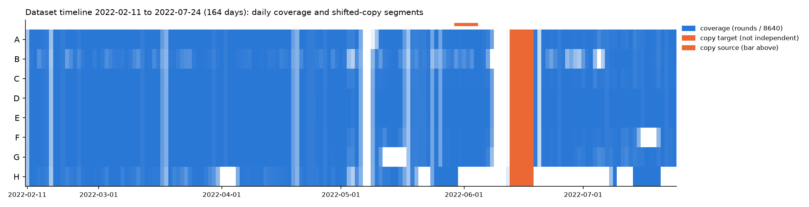

# 全数据集拷贝排查报告（2026-09-28，依 2026-09-28 裁决书《六月段"平移拷贝"发现的处置》）

## 摘要

全数据集（2022-02-11 至 2022-07-24，共 164 天，其中 159 天有数据）只发现**一段**平移拷贝：
2022-05-29 23:00 前后起约 7 天，平移 14 天，覆盖为 2022-06-12 23:00 前后至 2022-06-19 23:16。**8 台设备
全部是拷贝**。数值改动的方式是**加了扰动，不是取整精度不同**：整数通道加了几个单位以内的随机整数，
细粒度通道在大约一半的行上减去一个量化单位。

三月（点异常检测模块标定依据）与四月第一周（V-M3-4 原定验收段）都不在拷贝段内。H 设备日记录数
约为三倍的现象**与拷贝或重复块无关**，是恢复后采样频率约提高到三倍（约每 3 秒一次）。

扣除拷贝段后，A 至 G 的有效独立覆盖天数为 129.6 至 144.2 天，H 为 97.7 天。

## 一、排查方法

依 `eda/README.md` 第 5b 节的标准步骤：

1. `count_rounds.py`：全数据集逐设备逐日唯一轮数 → `docs/dataset_daily_rounds.csv`。
2. `find_copy_candidates.py`：8 台设备逐日轮数向量完全相同的日期对，平移天数不限 →
   `docs/copy_candidates.csv`。
3. `check_shift_copy.py`：在原始数据上逐设备核查 → `docs/copy_segments.csv`、差值直方图。
4. `copy_timeline.py`：时间线与有效独立覆盖天数 → `docs/figures/dataset_copy_timeline.png`、
   `docs/dataset_coverage.csv`。
5. `check_dense_days.py`：H 设备的密集日。

判据（逐设备）：时间戳对上超过 99%，且各连续通道（Gas、Humidity、Light、Pressure、Temperature、
RSSI）相关系数全部超过 0.99。

**方法的局限。** 候选按整天的轮数向量寻找，只能发现「平移整天数、且至少有一整天落在拷贝段内、
且各设备轮数未被改动」的拷贝。平移不足一天、只拷贝部分设备、或拷贝时增删了轮，都可能漏检。
本次找到的唯一一段满足全部条件；其他形态的拷贝不能由本次排查排除。

## 二、拷贝段清单

| 项目 | 值 |
| --- | --- |
| 源区间 | 2022-05-29 23:00 前后 至 2022-06-05 23:16 前后（整天部分为 05-30 至 06-04） |
| 目标区间 | 2022-06-12 23:00 前后 至 2022-06-19 23:16 前后（整天部分为 06-13 至 06-18） |
| 平移 | 14 天 |
| 拷贝设备 | A、B、C、D、E、F、G、H（8 台全部） |
| 整天部分的行数 | 2,974,032 |
| 时间戳对上 | 100.00%（每台设备各自都是 100%） |
| 数值精确相同 | 52.19% |

**逐设备连续通道相关系数的最小值**：A 0.995、B 0.999、C 0.993、D 0.998、E 0.997、F 0.998、G 0.998、H 1.000。

**逐通道（取各设备中的最小值）**：Gas 1.000、Humidity 1.000、Light 1.000、Pressure 0.9999、
Temperature 0.9999、RSSI 0.993。

**首尾两个零头日。** 候选按整天寻找，因此清单只含 06-13 至 06-18 六个整天。另有两个零头日同属拷贝：

- 06-19：8 台设备的轮数都恰为 06-05 减去 262 或 263 轮（H 两天均为 0），即数据在 23:16 结束所少的
  约 44 分钟。
- 06-12：只有最后一小时左右的数据（A 至 G 约 360 轮，H 1,170 轮）。H 的 1,170 轮与它在 05-29 的
  密集采样率（27,362 轮 ÷ 24 小时 ≈ 1,140 轮每小时）相符，与「拷贝起点为源数据 05-29 23:00」一致。
  这一小时没有在原始数据上逐行核对，属推断。

## 三、差值分布：加了扰动，不是取整

差值 = 拷贝值 − 平移后的源值，只统计 8 台被判为拷贝的设备。

| 通道 | 数值精确相同 | 差值的取值 | 最大绝对差 |
| --- | --- | --- | --- |
| Gas | 16.69% | 整数 −3、−2、−1、0、1、2，各约六分之一 | 3 |
| Pressure | 16.75% | 整数 −3 至 2，各约六分之一 | 3 |
| Light | 31.84% | 整数 −2 至 1，0 偏多 | 2 |
| Humidity | 50.13% | 0 或 −0.02，各约一半 | 0.02 |
| Temperature | 49.71% | 0 或 −0.02，各约一半 | 0.02 |
| RSSI | 50.11% | 0 或 −1，各约一半 | 1 |

差值直方图：`docs/figures/copy_diff_hist.png`。

**解读。** 取整精度不同时，差值应在正负半个末位单位之内且大致对称；这里的差值是离散的整数单位，
而且不对称：

- **整数通道**（Gas、Pressure）：拷贝值 = 源值 + 从 {−3, −2, −1, 0, 1, 2} 中均匀抽取的整数。
- **Light**：同样是小的整数扰动（−2 至 1）。0 偏多，推测是暗处读数为 0、不能再减，属推断。
- **细粒度通道**（Humidity、Temperature 的量化单位为 0.01，RSSI 为 1）：约一半的行被减去一个或两个
  量化单位，另一半不变。

这是**刻意添加的小扰动**。扰动幅度相对信号很小（相关系数不低于 0.993），拷贝段在统计上与源段
几乎相同，但**不是独立观测**：它是同一条物理轨迹加上噪声。

**对裁决书第三节问题的回答。** 拷贝段能否作为「近似真实」数据参与训练，从数据上看：数值是源段的
带噪复本，参与训练相当于把源段的一周按轻微扰动重复一次（相当于一种数据增强），不增加新的物理
信息。它不应计入独立覆盖，也不得参与任何验证。是否允许以这种身份参与训练，由设计会话决定。

## 四、时间线与有效独立覆盖

`docs/figures/dataset_copy_timeline.png`：设备 × 日期的覆盖率（当天轮数 ÷ 8,640），拷贝目标整天涂橙色，
源区间在上方以橙色条标出。无数据的日子：05-07、05-08，以及 06-09 至 06-11。

| 设备 | 总覆盖天数 | 有效独立覆盖天数（脚本，只扣整天） | 再扣首尾零头日 | **有效独立覆盖天数** |
| --- | --- | --- | --- | --- |
| A | 149.06 | 143.09 | 1.01 | **142.08** |
| B | 135.76 | 130.56 | 1.01 | **129.55** |
| C | 150.23 | 144.26 | 1.01 | **143.25** |
| D | 151.22 | 145.22 | 1.01 | **144.21** |
| E | 151.18 | 145.19 | 1.01 | **144.18** |
| F | 145.15 | 139.17 | 1.01 | **138.16** |
| G | 143.25 | 137.28 | 1.01 | **136.27** |
| H | 98.85 | 97.85 | 0.14 | **97.71** |

覆盖天数按「当天轮数 ÷ 8,640，封顶为 1」累加。H 在密集日的轮数超过 8,640，封顶后按一天计。

## 五、H 设备日记录数约为三倍（数据事实第十九条）

全数据集中 H 有 15 天超过 8,640 轮：05-25 至 05-30、06-13、07-09、07-14 至 07-20。它们都紧跟在 H 的
停机段之后（05-21 至 05-23 为 0，07-10 至 07-13 为 0），与「恢复后日记录数约为三倍」一致。

`check_dense_days.py` 的结果：

- **相位均匀分布**：每个密集日的时间戳对 10 取余都均匀落在 0 至 9 十个相位上，各约十分之一。正常
  设备每 10 秒采一次、相位固定；均匀分布说明 H 在这些日子**采样间隔约为 3 秒**，而不是在 10 秒网格上
  叠了几份拷贝。
- **平移对齐接近偶然水平**：除已知拷贝外，每条相位流在任何平移下最多只对上 30% 至 44%。作为参照，
  被比较的密集日各有约 2 万至 2.8 万个时间戳，占一天 86,400 秒的 24% 至 32%，这就是随机重合的水平。
  观测值略高于它，可能是因为采样在一天之内分布不均（例如某些时段更密），属推断；但与拷贝块应有的
  「只在唯一一个平移下对上接近 100%」相差甚远。
- **唯一的例外正是已知拷贝**：05-30 与 06-13 的每条相位流都只在 ±14 天下对上 100%。

**结论**：H 的三倍记录数是恢复后采样频率提高到约三倍，**与拷贝或重复块无关**。06-13 的密集是因为它
拷贝了 05-30。

## 六、据清单复核的地基

| 对象 | 与拷贝段的关系 | 结论 |
| --- | --- | --- |
| 三月（点异常检测模块标定依据） | 不重叠 | 地基不受影响 |
| 四月第一周（V-M3-4 原定验收段） | 不重叠 | 不在拷贝段内；但 **H 在 04-01 至 04-04 没有任何数据**，选定时须知情 |
| 逐月漂移证据（数据事实第二十七条） | 六月的月度统计含拷贝段 | **须复核**，见下 |
| M3 网格（六月段） | 训练集后半与全部早停集在拷贝段内 | 已在网格报告第五之三节注明 |

**逐月漂移证据。** 六月有数据的 27 天里，06-12 最后一小时至 06-19 这 7 天是 05-29 至 06-05 的带噪复本，
占六月约四分之一。任何按月汇总、再比较相邻月份的统计（例如 EDA 的 `ks_adjacent_months.csv`），其
六月一格都混入了五月末与六月初的复本，五月与六月的差异会被低估，六月与七月的差异会被影响。数据
事实第二十七条若依赖五月、六月、七月之间的比较，须剔除拷贝段后重算；若只依赖二月至五月，则不受
影响。第二十七条的原文不在本仓库，请设计会话据此判断。

## 七、产物

- `docs/dataset_daily_rounds.csv`：全数据集逐设备逐日轮数
- `docs/copy_candidates.csv`：候选（1 个）
- `docs/copy_segments.csv`：拷贝段清单
- `docs/dataset_coverage.csv`：逐设备覆盖天数（脚本口径，未扣首尾零头日）
- `docs/figures/dataset_copy_timeline.png`：时间线
- `docs/figures/copy_diff_hist.png`：差值直方图
