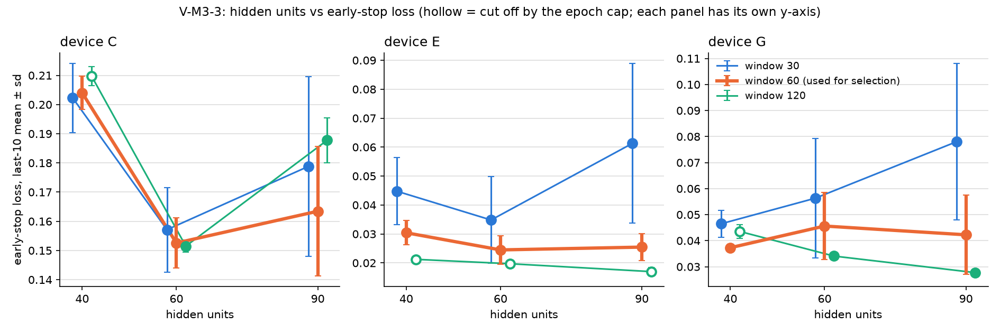

# M3 步骤 D 最终报告：补跑结果、跨设备汇总与选定值（2026-09-27）

## 摘要

按 2026-09-27 裁决书补跑了窗长 60 一列中被上限截断的三格（C 隐单元 40、C 隐单元 60、G 隐单元 40），
上限提到 300 轮，并附一格对照（G 隐单元 60）。三格都在 300 轮之内早停，无一再被截断。按裁决书第四节的
规则机械汇总，**选定隐单元 60、窗长 60**。这与作业现有默认值相同，因此默认值无需改动。

有一项须设计会话知情：**设备 C 在选定配置下要到第 111 轮才早停，超过了生产上限 100 轮**。按现行上限，
C 的在线冷启动会在第 100 轮被截断，早停集误差停在 0.175268，而不是继续训练后的 0.145298。详见第五节。

## 一、数据一致性

补跑与原网格用的是同一份数据，证据比预定的对照格更强：**四格在共有的全部轮次上，训练集误差与早停集
误差逐位相同**（三格的前 100 轮、对照格的全部 55 轮）。对照格的末十轮均值 0.04562383 也与原网格逐位一致。

重放完整性核验在六月段上的情况见 `docs/reports/m3_gate_june_segment_for_decision.md`，仍待设计会话确认。
由于选定值与现有默认值相同，这一确认不阻塞任何代码改动。

## 二、补跑结果

| 格 | 原网格（上限 100） | 补跑（上限 300） | 最低点（轮次） | 早停轮 | 训练耗时 |
| --- | --- | --- | --- | --- | --- |
| C 隐单元 40 | 100 轮*，0.197588 | 0.204015 ± 0.005702 | 0.185832（94） | 114 | 771.5 秒 |
| C 隐单元 60 | 100 轮*，0.189207 | **0.152560 ± 0.008605** | 0.143548（91） | 111 | 922.3 秒 |
| G 隐单元 40 | 100 轮*，0.037639 | 0.037302 ± 0.001247 | 0.034157（94） | 114 | 753.3 秒 |
| G 隐单元 60（对照） | 55 轮，0.045624 | 0.045624 ± 0.012844 | 0.027885（35） | 55 | 451.8 秒 |

带星号者为原网格中被上限截断。数值为末十轮均值 ± 标准差。

C 隐单元 40 的末十轮均值反而比截断时略高（0.204015 对 0.197588），因为统计窗口从第 91 至 100 轮移到
了第 105 至 114 轮，而它在第 94 轮达到最低点后没有再改善。这不影响结论。

## 三、窗长 60 一列与跨设备汇总

| 设备 | 隐单元 40 | 隐单元 60 | 隐单元 90 |
| --- | --- | --- | --- |
| C | 0.204015（1.337） | 0.152560（1.000） | 0.163448（1.071） |
| E | 0.030409（1.242） | 0.024488（1.000） | 0.025458（1.040） |
| G | 0.037302（1.000） | 0.045624（1.223） | 0.042256（1.133） |
| **最差倍数** | 1.337 | **1.223** | **1.133** |

括号内为相对该设备最优值的倍数。

按裁决书第四节：最差倍数最小的是隐单元 90（1.133），为首选；隐单元 60 的最差倍数 1.223 在首选的
1.10 倍（1.246）以内，视为并列；并列取参数更少者，**选定隐单元 60**。「相差不超过百分之十」若按绝对差
理解（1.223 − 1.133 = 0.090 ≤ 0.10），结论相同。

需要如实说明的一点：隐单元 60 的最差倍数来自 G 设备，而 G 隐单元 60 这一格很不稳定（标准差 0.012844，
最低点 0.027885 出现在第 35 轮，远低于末十轮均值）。规则是按末十轮均值机械套用的，这一格的抖动使
隐单元 60 显得偏差；若它更稳定，隐单元 60 的优势只会更明显，不会改变结论。

## 四、V-M3-3 图

`docs/figures/m3_v3_grid.png`：横轴隐单元数，纵轴末十轮均值 ± 标准差，每个窗长一条线，每台设备一个面板，
窗长 60 加粗；空心点为被 epoch 上限截断的格子（仅剩窗长 120 与 30 的若干格，它们已不参与选型）。
各面板纵轴独立，因为 C 的误差量级约为 E、G 的五到八倍。

## 五、实际轮数与需要知情的发现

| 选定配置下的设备 | 最低点轮次 | 早停轮 | 训练耗时（master 单线程） |
| --- | --- | --- | --- |
| **C** | **91** | **111** | **922.3 秒（约 15 分钟）** |
| E | 54 | 74 | 611.1 秒 |
| G | 35 | 55 | 451.8 秒 |

**设备 C 收敛最慢**，早停轮数是 E 的 1.5 倍、G 的 2 倍。这与它的基线约为另外两台的三倍一致，是估算冷启动
耗时时需要单独考虑的设备。

**C 的早停轮超过了生产上限。** 生产配置的上限是 100 轮（即 1600 次更新，裁决书第三节的长期规则）。
C 在选定配置下要到第 111 轮才早停，最低点在第 91 轮之后还经历了一段明显的回升（第 94 至 99 轮早停集
误差升到 0.247），在第 106 轮之后才重新下降。若按现行上限，C 的训练会停在第 100 轮：

| C 隐单元 60 | 早停集误差 | 末十轮均值 |
| --- | --- | --- |
| 第 100 轮被上限截断 | 0.175268 | 0.189207 |
| 继续训练到第 111 轮早停 | 0.145298 | 0.152560 |

两者相差约 20%，超过在线冷启动等值核验要求的 5%。也就是说，若核验以本报告的补跑值为参照，C 在现行
上限下会不通过；若以原网格截断时的值为参照，则会通过，但那个参照本身是被截断的结果。

我不自行调整上限，请设计会话在以下两种处置中择一，或另定：

1. 把生产上限提高（例如到 300 轮，即 4800 次更新，与补跑一致）。代价是 C 的冷启动训练时间从约 14 分钟
   增加到约 15 分钟（按本次实测），其他设备不受影响，因为它们在 100 轮之前已经早停。
2. 维持上限 100 轮，等值核验改以截断时的网格值为参照，并接受 C 的模型未充分训练。

## 五之二、训练集横跨停机的清点（2026-09-27 裁决书第三节）

裁决书指出：数据段按轮数而不是日历划分，六月段含 102 小时的全场停机（06-08 至 06-12 23 时），
因此训练集横跨这场停机。用 `syn-m3-grid.sh --split-report`（与训练相同的切分，不训练）在窗长 60 下
清点的结果如下。判据：窗口内相邻两轮相隔至少 6 小时即算跨停机；离群轮落在停机恢复后 1 小时以内
即算恢复浪涌轮。

| 设备 | 训练窗 | 剔除窗 | 跨停机的训练窗 | 跨停机的早停窗 | 因恢复浪涌轮被剔除的训练窗 |
| --- | --- | --- | --- | --- | --- |
| A | 999 | 9 | 1 | 0 | 1 |
| B | 1001 | 7 | 1 | 0 | 1 |
| C | 991 | 17 | 1 | 0 | 1 |
| D | 1004 | 4 | 1 | 0 | 1 |
| E | 1001 | 7 | 1 | 0 | 1 |
| F | 1006 | 2 | 1 | 0 | 1 |
| G | 981 | 27 | 1 | 0 | 1 |
| H | 44 | — | — | — | — |

A 至 G 每台恰有 1 个训练窗跨停机，符合裁决书「至多一个」的预期；早停集都不跨停机。每台都恰有 1 个
训练窗因含恢复浪涌离群轮被剔除，只占各自剔除窗的一小部分（C 为 17 个中的 1 个，G 为 27 个中的 1 个）。
三台网格设备受同样的影响，不改变网格结论。H 可用轮只有 2,714 轮，训练窗 44 个、早停窗 0 个，
程序按样本不足跳过。

**附带发现，与下一步有关。** B 的早停集只有 141 窗（其他设备为 288 窗），因为 B 的可用轮只有
68,970 轮，不够 7 天训练加 2 天早停。另外，所有设备的可用轮都低于在线冷启动的触发阈值
（(7 + 2 + 2) × 8,640 = 95,040 轮），最多的 D 也只有 92,191 轮。也就是说，**六月段不足以在任何一台
设备上触发在线冷启动**，第二批在线验收需要更长的重放段。这一点在 2026-09-21 针对设备 E 报告过，
现在确认对全部设备都成立。

## 六、附带观察

隐单元 90 在窗长 30 下最不稳定：三台设备的末十轮标准差分别为 0.0308、0.0276、0.0301，是同设备其他组合
的数倍。按裁决书第五节记入报告，不作决定依据。

## 七、写入的默认值

| 项目 | 取值 | 是否改动 |
| --- | --- | --- |
| 隐单元数 `m3-hidden-size` | 60 | 与现有默认值相同，未改动 |
| 窗长 `m3-window-length` | 60 | 与现有默认值相同，未改动 |

## 八、待办

1. 设计会话确认第五节的上限处置，以及六月段核验依据。
2. 在线冷启动等值核验（早停集误差与网格值相差不超过 5%），参照值取决于第五节的处置。
3. 部署配置中 `kafka-1` 未挂载数据卷的问题，见核验报告第四节。

## 数据文件

- 原网格：`docs/m3_grid.csv`、`docs/m3_grid_per_epoch.csv`
- 补跑：`docs/m3_grid_rerun.csv`、`docs/m3_grid_rerun_per_epoch.csv`
- 汇总与作图：`python3 deploy/scripts/m3_grid_final.py --grid docs/m3_grid.csv --grid-cap 100 --rerun docs/m3_grid_rerun.csv --rerun-cap 300 --out docs/figures/m3_v3_grid.png`
